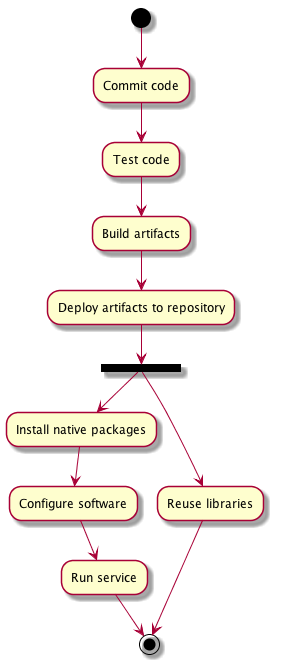
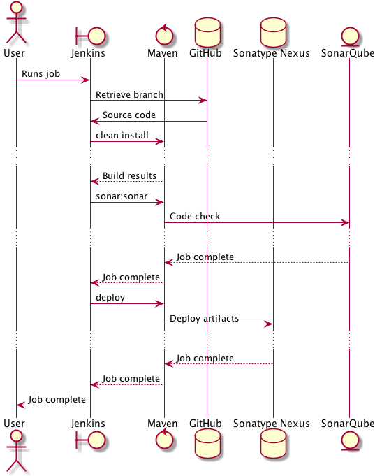

# Operational Documentation

This repository contains documentation for deploying the release management system and operational documentation.

## Services quick links

* [Jenkins Software builder](http://jenkins.ihtsdotools.org)
* [Jenkins Deployer](http://ansible.ihtsdotools.org)
* [Sonatype Nexus](https://maven.ihtsdotools.org)
* [SonarQube](https://sonarqube.ihtsdotools.org)
* [JIRA](https://jira.ihtsdotools.org)

## Third party software documentation

* [Ansible](http://docs.ansible.com)
* [SonarQube](http://www.sonarqube.org/documentation)
* [Sonatype Nexus](http://books.sonatype.com/nexus-book/reference/index.html)
* [Jenkins](https://wiki.jenkins-ci.org/display/JENKINS/Use+Jenkins)
* [Jgitflow](https://bitbucket.org/atlassian/jgit-flow/wiki/Home)

## Overview

The build and release process is broken into a number of distinct stages.

### Building

The build process is run by [Jenkins](http://build.ihtsdotools.org) and Maven, with Jenkins triggering the build and controlling progress through the stages, and Maven doing the actual build.

Source is stored at [GitHub](http://github.com/IHTSDO). Most repositories are public, with a few exceptions. Jenkins needs write access to the repositories, especially for the [release process](#releaseprocess).

As was as the usual collection of jars, Debian native packages are produced using the [jdeb Maven plugin](https://github.com/tcurdt/jdeb).

During the build phase, the code is analysed by [SonarQube](https://sonar.ihtsdotools.org) producing a code quality report.

The resulting artifacts are deployed to [Sonatype Nexus](https://maven.ihtsdo.org). Nexus has an [apt plugin](https://github.com/inventage/nexus-apt-plugin), which generated apt metadata from deb packages uploaded to repositories.

# Build Lifecycle

The broad life cycle runs as follows:

* Configure the project master pom.xml to use jgitflow.
* Configure GitHub repository to allow the 'Cloud Build Servers' access.
* Configure maven to produce .deb files via the jdeb plugin. See the [SNOMED Release Service API pom.xml](https://github.com/IHTSDO/snomed-release-service/blob/master/api/pom.xml#L153) for an example
* Create the src/deb tree containing the supervisor.conf to start the app and the control directory containing the control file, pre and port scripts. Again see the [SNOMED Release Service API](https://github.com/IHTSDO/snomed-release-service/tree/master/api/src/deb) for examples.
* These two combined should produce a working .deb file which is self contained and listens on a given port
* Set up SNAPSHOT and RELEASE jobs in Jenkins by cloning existing jobs and editing. Be sure to check advanced configuration options as they be hidden in the default view. GitHub hooks will be automatically configured.
* Upon running the jobs, the deb packages should be produced and all artifacts uploaded to the [Nexus Repository](https://nexus.ihtsdotools.org).

# Deploy life cycle

* In the IHTSDO ansible repository and associated inventory, copy an existing role to a new folder and edit for the new application (in particular, check default and naming).
* Add new groups the the inventory files with appropriate configuration.
* On the [Ansible Jenkins server](https://ansible.ihtsdotools.org) clone an existing job and edit as required.

# Adding a new server

* Create the server in Digital Ocean's control panel, adding your SSH key to the server.
* Edit the appropriate ansible inventory files to add the new server
* Run: `ansible-playbook -i inventory/INVENTORY_FILE user_management.yaml -u root`
* Run the appropriate playbook, e.g. `ansible-playbook -i inventory/INVENTORY_FILE snomed_release_service.yml`

